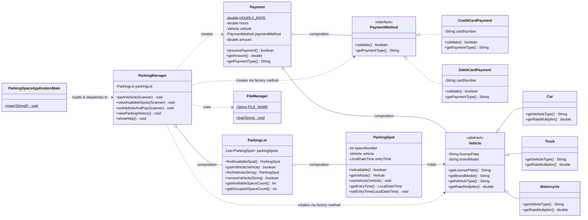

# Part B — Design

## UML Class Diagram

**Legend:** `<|..` realization (implements), `<|--` inheritance (extends), `o--` composition, `..>` dependency/uses, `*` = abstract member, `$` = static member.

## Concept-to-Code Mapping Table

| OOP Concept | Where it appears | How |
|---|---|---|
| Abstraction | `PaymentMethod` interface, `Vehicle` abstract class | Callers depend only on *what* a type does, not *how* |
| Encapsulation | Private fields + getters throughout; `ParkingLot.getParkingSpots()` returns an unmodifiable view | Internal state can't be mutated from outside without going through controlled methods |
| Inheritance | `Vehicle` → `Car`, `Truck`, `Motorcycle` | Shared fields (`licensePlate`, `brandModel`) and shared getters live once, in the parent |
| Polymorphism | `Payment` constructor calls `vehicle.getRateMultiplier()`;  calls `paymentMethod.validate()` | Same call site resolves to different behavior depending on the object's real runtime type |
| Interfaces (multi-impl) | `PaymentMethod` → `CreditCardPayment`, `DebitCardPayment` | `Payment` is written once against the interface |
| `final` usage | `CreditCardPayment`, `DebitCardPayment`, `FileManager`, `ParkingLot`, `Payment`, `Car`, `Truck`, `Motorcycle`; `HOURLY_RATE` constant | Protects invariants / documents "not meant to be extended" |
| Design pattern | Simple Factory (`ParkingManager.createVehicle`, `ParkingManager.choosePaymentMethod`) | See rationale below |

## Design Rationale

### Interfaces vs. abstract classes

- **`PaymentMethod` is an interface** because credit and debit card
  payments share **no code and no state** — only a contract ("can
  validate itself, can name itself"). There's nothing to factor out
  into a common base; each implementation is genuinely independent.
  This is the textbook case for an interface.
- **`Vehicle` is an abstract class** because `Car`, `Truck`, and
  `Motorcycle` share **real state** (`licensePlate`, `brandModel`) and
  **real inherited behavior** (`getLicensePlate()`, `getBrandModel()`)
  alongside the parts that vary (`getVehicleType()`,
  `getRateMultiplier()`). An interface can't hold that shared state —
  duplicating the same two fields and getters into all three subclasses
  independently would be worse design. The abstract class lets the
  shared part live once, in the parent, while still forcing every
  subclass to supply its own type label and rate multiplier.
- **Rule of thumb applied:** interface = "can do X" with no shared
  implementation (`PaymentMethod`); abstract class = "is a X" with real
  shared state/behavior plus some abstract parts subclasses must fill
  in (`Vehicle`).

### Composition over inheritance

- **`Payment` has-a `Vehicle` and has-a `PaymentMethod`**, rather than
  extending either. A payment isn't a kind of vehicle or a kind of
  payment method — it's an object that *depends on* both to do its job
  (compute a fee using the vehicle's rate multiplier, validate the
  payment method). Composition lets `Payment` combine any vehicle with
  any payment method without needing a combinatorial explosion of
  subclasses (`CarCreditCardPayment`, `TruckDebitCardPayment`, etc.).
- **`ParkingManager` has-a `ParkingLot`**, for the same reason — the
  manager orchestrates the lot, it isn't a specialized kind of lot.
  This keeps `ParkingLot` fully testable and reusable independent of
  how (or whether) a console menu drives it.
- **The one place real inheritance is used (`Vehicle`)** is justified
  precisely because it's a genuine "is-a" relationship with shared
  state — not because inheritance is the default choice.

### Design pattern used: Simple Factory

`ParkingManager.createVehicle(...)` and
`ParkingManager.choosePaymentMethod(...)` both take user input and
decide which concrete class to instantiate (`Car`/`Truck`/`Motorcycle`,
or `CreditCardPayment`/`DebitCardPayment`), returning the result typed
as the abstraction (`Vehicle`, `PaymentMethod`). This is a **Simple
Factory pattern**: it centralizes "which concrete type do I build?"
logic in one place, so the rest of the code (`ParkingLot`, `Payment`)
never needs to know or care which concrete class it's holding — it only
ever calls the abstract/interface methods (`getRateMultiplier()`,
`validate()`). This is what makes the vehicle-type-based pricing work
without `ParkingLot` or `Payment` ever branching on vehicle type
themselves.

### `final` usage

`Car`, `Truck`, `Motorcycle`, `CreditCardPayment`, `DebitCardPayment`,
`Payment`, `ParkingLot`, and `FileManager` are all marked `final`
because each fully implements its behavior and has no legitimate
subtype in this domain — locking them down prevents an unintended
hierarchy from being introduced later that could silently override
validation or fee logic (e.g. a hypothetical subclass of
`CreditCardPayment` that skips the 16-digit check). `HOURLY_RATE` in
`Payment` is a `private static final` constant for the same reason
constants generally are: it's a single source of truth that must not
drift.

`Vehicle` remains non-final (and, being `abstract`, cannot be `final` —
the two modifiers are mutually exclusive in Java) because it is the one
class explicitly designed to be extended as new vehicle types are
added. `ParkingManager` and `ParkingSpaceApplicationMain` are also left
non-final: they sit in the orchestration/entry-point layer rather than
the domain layer, and there is no invariant at risk from subclassing
them, so `final` would add no protective value there.
